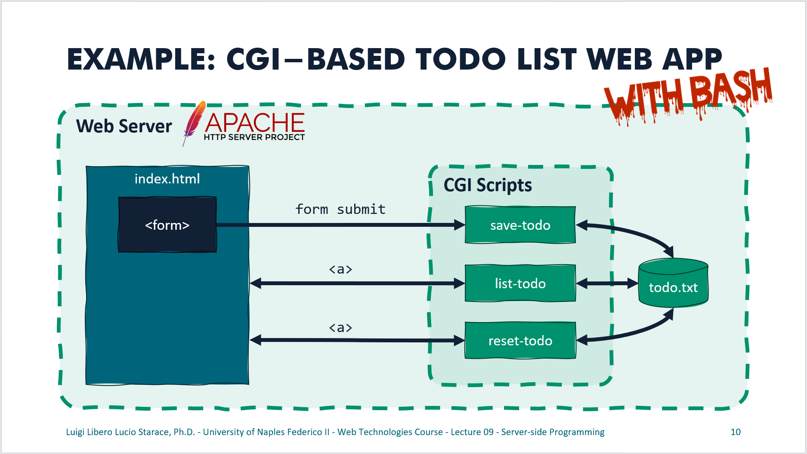

# CGI Example: To-do List with Bash

This example includes a simple implementation of To-do List Web Application using Apache HTTPd, CGI, and Bash.

## Running this example

Running this example the easy way requires Docker to be installed on your computer.
If you have Docker installed you can simply clone this repository, then run `docker compose up` in the root directory (the one containing the `docker-compose.yml` file). The application will be available at http://localhost:8080.

If you do not wish to use Docker, you will need to configure your sistem to run bash scripts (e.g.: install bash in a Linux environment, or use WSL). You will also need to install Apache HTTPd (2.4.57 recommended), to use the provided configuration file `httpd.conf`, and to make sure to copy the files included in the `./static` directory into Apache httpd `htdocs` directory (e.g.: `/usr/local/apache2/htdocs/`), and the files included in the `cgi-bin` directory into the Apache httpd `cgi-bin` directory (e.g.: `/usr/local/apache2/cgi-bin/`).

## Overview of the web app

An overview of the web app is shown in the figure below and described as follows.


* `index.html` is a static HTML document. It includes a form, which submits data to the CGI script in `/cgi-bin/save-todo`, and two links to the CGI scripts in `/cgi-bin/list-todo` and `/cgi-bin/reset-todo`.
* `todo.txt` is the database used by this web app. To-Do items are saved in distinct lines of this text file.
* `list-todo` is the CGI script responsible for showing the current list of To-Do items. It reads the `todo.txt` files and produces a simple web page with a list as an output.
* `reset-todo` deletes all content from the `todo.txt` file and shows a simple web page with a confirmation message.
* `save-todo` receives a POST request made by the form in the static `index.html` file, and adds items to `todo.txt`. This CGI script is slightly more complex than the others.
  * It inspects the method of the incoming request. If it's not POST, it shows a web page with an error message.
  * It needs to parse the body of the incoming POST request, which will contain a string of the form `todo=XXX`.
  * It needs to `url_decode` the value provided by the user. Recall that an input like `Solve P=NP` will be encoded as `Solve%20P%3DNP`, so we need to decode it back. That's what the (cryptic) one-liner (also reported hereafter) at Line 2 of `save-todo` does.
  ```bash
  function url_decode() { : "${*//+/ }"; echo -e "${_//%/\\x}"; }
  ```